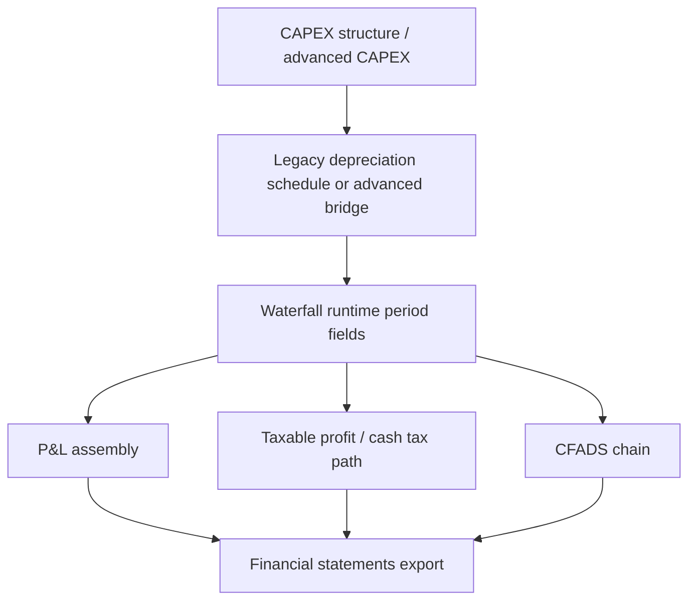
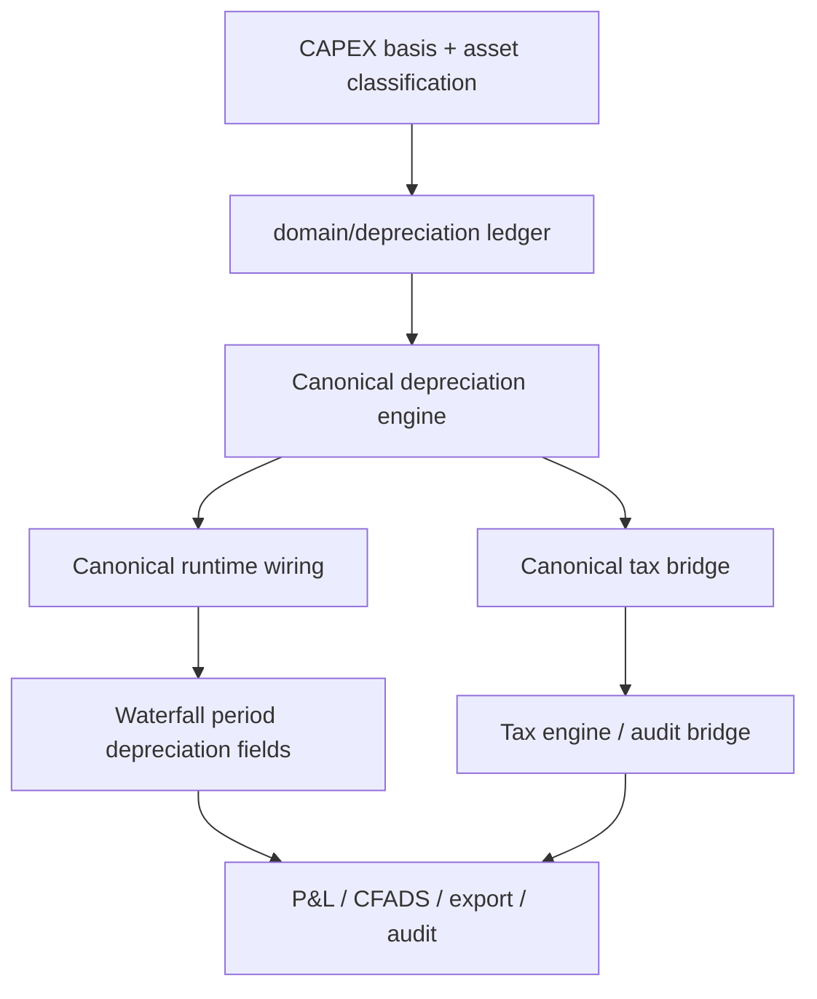

# Depreciation Enablement Readiness Review

> Type: analysis-only / report-only
> Branch: `phase-depreciation-enablement-readiness-review`
> Base intent: latest `main`
> Status: no implementation, no runtime change, no flag enablement
> Recommendation headline: **NO-GO for runtime enablement today**

## 1. Executive summary

Depreciation is one of the highest-value remaining Excel-parity improvements,
but the current architecture is split across multiple layers with different
levels of maturity:

- a **legacy runtime depreciation path** is active today
- a **canonical depreciation domain package** exists and is partially wired
  behind flags
- a **pure SPV tax engine** exists, but is not the authoritative runtime tax
  path
- **financial statement assembly** already consumes depreciation-shaped fields
  from runtime outputs
- **export and audit surfaces** exist, but are not yet generic-project-complete

The codebase is therefore **not missing depreciation architecture**. The real
issue is that the architecture is **not yet cleanly consolidated into one
generic, reviewer-safe, runtime-authoritative enablement path**.

### Bottom-line recommendation

**NO-GO** for broad depreciation runtime enablement.

Safe enablement is not ready for:

- TUHO + Oborovo together
- generic projects
- tax / CFADS / reviewer-confidence-sensitive promotion

The safest next move is an enablement sequence that improves **audit visibility,
flag discipline, and shadow validation first**, before any runtime promotion.

## 2. Files reviewed

### Core depreciation domain

- `domain/depreciation/__init__.py`
- `domain/depreciation/asset.py`
- `domain/depreciation/schedule.py`
- `domain/depreciation/result.py`
- `domain/depreciation/ledger.py`
- `domain/depreciation/engine.py`
- `domain/depreciation/tax_bridge.py`
- `domain/depreciation/canonical_wiring.py`

### Offline / legacy depreciation packages

- `domain/depreciation_offline/__init__.py`
- `domain/depreciation_offline/config.py`
- `domain/depreciation_offline/categories.py`
- `domain/depreciation_offline/result.py`
- `domain/depreciation_offline/engine.py`
- `app/depreciation_engine.py`
- `app/depreciation_bankable.py`
- `domain/financing/depreciation.py`
- `domain/financing/depreciation_schedule.py`

### Runtime / tax / statement wiring

- `domain/inputs.py`
- `app/waterfall_runner.py`
- `app/waterfall_core.py`
- `domain/waterfall/waterfall_engine.py`
- `domain/tax/engine_runner.py`
- `domain/financial_statements/pnl.py`
- `domain/financial_statements/tax_bridge.py`
- `domain/financial_statements/assembly.py`
- `domain/financial_statements/balance_sheet.py`
- `domain/reporting/financial_statements.py`

### Export / audit / UI surfaces

- `app/output_tables.py`
- `app/ui/pages.py`
- `app/tax_ui.py`
- `app/excel_export.py`
- `app/export/institutional_workbook.py`
- `app/export/calibration_reconciliation.py`
- `app/persistence/provenance.py`

### Existing design / review docs

- `docs/depreciation_integration_status.md`
- `docs/depreciation_review_package.md`
- `docs/excel_depreciation_roadmap.md`
- `docs/pre_depreciation_merge_review.md`
- `docs/phase57a10d_capex_vat_wht_depreciation_basis_design.md`
- `docs/phase57a10e_capex_tax_metadata_persistence_design.md`
- `docs/runtime_wiring_plan.md`

### Validation / parity / regression tests reviewed

- `tests/test_depreciation.py`
- `tests/test_depreciation_engine_offline.py`
- `tests/test_depreciation_engine.py`
- `tests/test_depreciation_tax_bridge.py`
- `tests/test_depreciation_canonical_wiring.py`
- `tests/test_depreciation_wiring.py`
- `tests/test_book_depreciation_pnl_bridge.py`
- `tests/test_financial_statements_tuho_pnl_parity.py`
- `tests/test_financial_statements_oborovo_pnl_parity.py`
- `tests/test_generic_tax.py`
- `tests/test_generic_solar_wind_runtime.py`

## 3. Architecture inventory

### 3.1 `domain/depreciation/asset.py`

- **Purpose:** asset-class input dataclass for canonical depreciation
- **Status:** implemented
- **Runtime usage:** indirect, through canonical engine / canonical wiring only
- **Feature flag dependency:** yes, practical runtime relevance depends on
  `use_depreciation_canonical_engine`
- **Parity dependency:** high, because asset-class basis quality drives both tax
  and book depreciation shape

### 3.2 `domain/depreciation/schedule.py`

- **Purpose:** canonical policy dataclass and straight-line period helper
- **Status:** implemented
- **Runtime usage:** indirect through canonical ledger/engine
- **Feature flag dependency:** yes
- **Parity dependency:** high, because useful-life and start-period handling
  directly affect parity

### 3.3 `domain/depreciation/result.py`

- **Purpose:** canonical period and aggregate result dataclasses
- **Status:** implemented
- **Runtime usage:** indirect through engine, tax bridge, canonical wiring
- **Feature flag dependency:** yes
- **Parity dependency:** medium to high; these are audit/result containers, not
  policy owners

### 3.4 `domain/depreciation/ledger.py`

- **Purpose:** core per-asset, per-period book/tax depreciation ledger builder
- **Status:** implemented
- **Runtime usage:** indirect through canonical engine and TUHO book-dep P&L
  bridge fixture path
- **Feature flag dependency:** yes for canonical runtime use; no for offline /
  test utility use
- **Parity dependency:** high

### 3.5 `domain/depreciation/engine.py`

- **Purpose:** canonical depreciation engine wrapper that turns ledger output
  into audit-rich runtime-ready results
- **Status:** implemented
- **Runtime usage:** partial, only when canonical runtime flag path is used
- **Feature flag dependency:** yes, `use_depreciation_canonical_engine`
- **Parity dependency:** high for TUHO / Oborovo if promoted

### 3.6 `domain/depreciation/tax_bridge.py`

- **Purpose:** adapter from canonical depreciation outputs into tax-shaped audit
  series
- **Status:** implemented, explicitly positioned as bridge / validation layer
- **Runtime usage:** effectively audit-only today
- **Feature flag dependency:** conceptually tied to
  `use_canonical_tax_depreciation_bridge`, but the file itself documents that it
  does **not** wire runtime authority by default
- **Parity dependency:** high, because this is the cleanest future path from
  depreciation into taxable income

### 3.7 `domain/depreciation/canonical_wiring.py`

- **Purpose:** runtime adapter that aggregates canonical depreciation engine
  output into waterfall fields
- **Status:** implemented
- **Runtime usage:** partial, only behind canonical depreciation flag
- **Feature flag dependency:** yes, `use_depreciation_canonical_engine`
- **Parity dependency:** very high; this file is the main runtime enablement
  hinge

### 3.8 `domain/depreciation/__init__.py`

- **Purpose:** public canonical depreciation surface
- **Status:** implemented
- **Runtime usage:** convenience surface only
- **Feature flag dependency:** indirect
- **Parity dependency:** low directly, medium indirectly

## 4. Adjacent depreciation stacks

### 4.1 `domain/depreciation_offline/*`

This is an older / alternate offline-only depreciation stack:

- `config.py` / `categories.py`: rule and template registry
- `engine.py`: straight-line engine with simplified book=tax behavior
- `result.py`: schedule dataclasses

**Assessment**

- **Purpose:** earlier offline engine and schedule tooling
- **Status:** implemented, but explicitly offline
- **Runtime usage:** none in authoritative runtime path
- **Feature flag dependency:** no runtime flag path
- **Parity dependency:** low to medium as evidence, not as enablement path

**Readiness takeaway**

This package is useful as historical context and test surface, but it is **not**
the package that should be promoted into runtime enablement decisions.

### 4.2 `app/depreciation_engine.py`

- **Purpose:** application-layer depreciation schedule generator used by the
  pre-bankable advanced CAPEX runtime path
- **Status:** implemented, legacy-active bridge
- **Runtime usage:** yes, via `advanced_capex_depreciation_schedule`
- **Feature flag dependency:** no separate depreciation flag required when
  advanced CAPEX schedule is injected
- **Parity dependency:** medium to high, but with known simplifications

### 4.3 `app/depreciation_bankable.py`

- **Purpose:** richer tax/book depreciation framework with asset classes,
  profiles, tax/book split, and disclosure helpers
- **Status:** implemented
- **Runtime usage:** partially used for export/disclosure surfaces, not the main
  runtime authority
- **Feature flag dependency:** no direct runtime promotion flag
- **Parity dependency:** high potential value, but not yet the runtime truth

### 4.4 `domain/financing/depreciation.py` and `depreciation_schedule.py`

- **Purpose:** legacy financing-era depreciation schedule logic consumed by
  current waterfall setup
- **Status:** implemented and active
- **Runtime usage:** yes
- **Feature flag dependency:** no
- **Parity dependency:** very high today, because this is still part of the
  default active path

## 5. Runtime wiring inventory

## 5.1 Where depreciation is currently calculated

### Active default runtime path

Default runtime still uses:

- `domain/financing/depreciation_schedule.build_depreciation_schedule()`
- called from `app/waterfall_core.py`
- produces annual schedule
- then pro-rated into per-period depreciation by `day_fraction`

This default path is active when:

- no canonical depreciation flag is enabled
- no alternative runtime promotion is selected

### Advanced CAPEX bridge path

`app/ui_runner.py` can inject:

- `advanced_capex_depreciation_schedule`

which then flows through:

- `app/waterfall_runner.py`
- `app/waterfall_core.py`

This is a real runtime-affecting path, but it is still not the same as
promoting the canonical `domain/depreciation` package.

### Canonical depreciation runtime path

When `use_depreciation_canonical_engine=True`:

- `app/waterfall_core.py` calls
  `domain.depreciation.canonical_wiring.build_canonical_depreciation_wiring()`
- canonical book depreciation overwrites runtime `period.depreciation_keur`
- canonical tax depreciation overwrites runtime
  `period.tax_depreciation_audit_keur`
- `_canonical_depreciation_wiring` is attached to the result

This is the clearest candidate for future runtime enablement, but it is still
flag-gated and not generic-project-proven.

## 5.2 Where depreciation is stored

Depreciation is not persisted as a first-class runtime ledger in the project
persistence layer.

Today it lives as:

- computed runtime period fields
- assembled statement fields
- export tables / audit tables
- optional audit attachments like `_canonical_depreciation_wiring`

That means enablement risk is mostly about **runtime authority and audit
visibility**, not persistence migration.

## 5.3 Where depreciation is exported

### Current export surfaces

- `Tax_Depreciation` sheet from `build_tax_depreciation_table(result)`
- `Tax Depreciation` disclosure sheet in `app/excel_export.py`
- `Book Depreciation` disclosure sheet in `app/excel_export.py`
- institutional workbook sections:
  - tax depreciation
  - P&L depreciation
  - accumulated depreciation
- calibration reconciliation surfaces:
  - runtime `depreciation_keur`
  - runtime `tax_depreciation_audit_keur`

### Important nuance

The export surface is **not single-source-of-truth clean yet**:

- some sheets come from runtime period fields
- some come from bankable disclosure builders
- some are audit-only notes about missing Excel evidence

So export coverage exists, but **runtime authority vs audit disclosure authority
is still mixed**.

## 5.4 Where depreciation is ignored or only partially used

- `domain/tax/engine_runner.py` is pure and not the authoritative waterfall tax
  path
- `domain/depreciation/tax_bridge.py` explicitly does not wire runtime authority
- generic-project runtime validation is incomplete
- CAPEX 2.0 metadata does not yet drive depreciation basis

## 5.5 Where depreciation is gated

### Flags currently involved

From `domain.inputs.ProjectInfo` and `app.waterfall_runner.WaterfallRunConfig`:

- `use_depreciation_canonical_engine`
  - main runtime promotion gate for canonical depreciation
- `use_canonical_tax_depreciation_bridge`
  - design / provenance flag surface for tax-side canonical bridge
- `use_book_depreciation_for_pnl`
  - P&L-specific bridge flag
- `use_tax_bridge_engine`
  - not a depreciation flag, but materially affects downstream tax and cash-tax
    consumption of depreciation-shaped fields

### Flag map

| Flag | Current role | Current readiness |
|---|---|---|
| `use_depreciation_canonical_engine` | canonical runtime replacement for depreciation fields | partial |
| `use_canonical_tax_depreciation_bridge` | canonical tax bridge intent / provenance | partial, not promoted |
| `use_book_depreciation_for_pnl` | TUHO-only book P&L bridge | narrow, not generic-ready |
| `use_tax_bridge_engine` | TUHO tax bridge runtime path | validated for TUHO-specific work, not generic depreciation enablement |

## 6. Dependency map

## 6.1 Runtime chain today

## 6.2 Canonical future chain

## 7. Excel comparison map

### 7.1 Excel path

Excel target path described by review objective:

1. CAPEX
2. depreciation schedule
3. tax depreciation
4. taxable income
5. CIT
6. P&L
7. cash flow

### 7.2 FincoGPT path today

1. CAPEX
   - **PARTIAL**
   - CAPEX exists, but depreciation basis is split across legacy capex-item
     assumptions, advanced CAPEX schedule path, and not-yet-runtime-active CAPEX
     metadata
2. depreciation schedule
   - **PARTIAL**
   - multiple depreciation schedule paths exist
3. tax depreciation
   - **PARTIAL**
   - runtime tax depreciation field exists, but canonical tax bridge is not the
     sole active authority
4. taxable income
   - **PARTIAL**
   - available in runtime/audit fields, but path differs between default runtime,
     TUHO tax bridge, and pure SPV tax engine designs
5. CIT
   - **PARTIAL**
   - runtime cash/accrual tax fields exist, but generic-project validation is
     incomplete
6. P&L
   - **PARTIAL**
   - statement assembly exists, but book depreciation path is gated and TUHO-only
     in key places
7. cash flow
   - **PARTIAL**
   - depreciation influences tax and thus CFADS/cash, but enablement confidence
     is not generic-project-safe

### 7.3 Comparison table

| Excel step | FincoGPT path | Classification | Why |
|---|---|---|---|
| CAPEX basis | legacy capex items + advanced CAPEX bridge + future CAPEX metadata | PARTIAL | basis ownership not yet unified |
| depreciation schedule | legacy schedule + bankable schedule + canonical ledger | PARTIAL | more than one competing schedule source |
| tax depreciation | runtime `tax_depreciation_audit_keur` + canonical bridge + tax engine templates | PARTIAL | not one promoted authority |
| taxable income | runtime tax audit fields + tax engine | PARTIAL | path differs by branch / flag mode |
| CIT | runtime tax fields + tax bridge engine | PARTIAL | TUHO-specific validation stronger than generic |
| P&L | statement assembly from runtime fields, optional book bridge | PARTIAL | book path not generic-ready |
| cash flow / CFADS | indirect through tax and waterfall | PARTIAL | safe explanation exists, but enablement blast radius is broad |

## 8. Risk register

## 8.1 P&L

- **Risk:** HIGH
- **Why:** `assemble_pnl()` defaults to `period.tax_depreciation_audit_keur` unless
  the book bridge flag is enabled; the book bridge itself is TUHO-only and
  fixture-backed

## 8.2 Tax

- **Risk:** HIGH
- **Why:** there is a clean tax engine and a clean canonical tax bridge, but the
  authoritative runtime tax path is still mixed with legacy/tax-bridge-specific
  logic

## 8.3 Cash flow / CFADS chain

- **Risk:** HIGH
- **Why:** depreciation affects taxable profit, cash tax, and therefore CFADS,
  DSCR interpretation, and reviewer trust; a wrong promotion here creates
  second-order errors

## 8.4 Export

- **Risk:** MEDIUM
- **Why:** many export surfaces already exist, but they mix runtime values,
  offline assemblies, and disclosure-only schedules; reviewers could easily read
  them as more authoritative than they are

## 8.5 Generic projects

- **Risk:** HIGH
- **Why:** generic solar/wind runtime tests exist, but depreciation-specific
  generic validation is not yet the same as TUHO / Oborovo parity-grade evidence

## 8.6 TUHO

- **Risk:** MEDIUM
- **Why:** TUHO has the deepest evidence and flag-aware tests, but several
  depreciation-related bridges are still explicit fixtures or special-case paths

## 8.7 Oborovo

- **Risk:** MEDIUM to HIGH
- **Why:** Oborovo has parity tests, but the book-depreciation-for-P&L path is
  explicitly rejected for Oborovo and generic promotion confidence is weaker

## 9. Validation readiness

## 9.1 TUHO only

**Can depreciation be enabled safely for TUHO only?**

**Not yet as a broad production enablement.**

Why:

- TUHO has the best evidence coverage
- TUHO-specific bridges already exist
- but several parts still rely on fixture-backed or branch-era assumptions
- enabling the wrong combination of flags could still distort P&L / tax / CFADS

Assessment:

- **best candidate for shadow mode**
- **not yet ready for confident broad enablement**

## 9.2 TUHO + Oborovo

**Can depreciation be enabled safely for TUHO + Oborovo together?**

**No.**

Why:

- TUHO and Oborovo do not currently share the same evidence maturity
- the P&L book bridge is intentionally TUHO-only
- enabling both under one readiness claim would overstate parity confidence

## 9.3 Generic projects

**Can depreciation be enabled safely for generic projects?**

**No.**

Why:

- generic tax outputs are not yet generic-project validated to the same standard
- CAPEX metadata-to-depreciation basis is not runtime-enabled
- export/audit surfaces are not yet a clean generic reviewer story

## 10. Missing pieces / blockers

### 10.1 Architecture blockers

- multiple depreciation schedule sources still coexist
- CAPEX 2.0 scalar metadata is now persisted, but not yet consumed by any
  depreciation authority
- canonical tax bridge is not yet the single promoted runtime authority

### 10.2 Validation blockers

- no single end-to-end depreciation enablement matrix across TUHO, Oborovo, and
  generic projects
- no explicit shadow-mode comparison pack for legacy vs canonical depreciation
- no generic-project depreciation audit acceptance pack

### 10.3 Export / audit blockers

- export surfaces exist, but runtime-authoritative vs disclosure-only ownership
  is not yet explicit enough for promotion
- missing one consolidated depreciation provenance surface showing:
  - source schedule
  - flag state
  - tax/book split
  - downstream tax / P&L effect

### 10.4 Reviewer-confidence blockers

- book depreciation for P&L is not generally enabled
- tax depreciation and book depreciation ownership still require reviewer
  explanation rather than being self-evident from one path
- generic project behavior is not yet explicitly validated

## 11. Recommended implementation sequence

## D0 - Readiness inventory closeout

Goal:

- freeze the architecture inventory
- freeze the runtime flag map
- freeze the authoritative vs non-authoritative surface map

Deliverables:

- this readiness review
- explicit GO / NO-GO call

## D1 - Export and audit visibility hardening

Goal:

- make depreciation provenance visible without changing runtime authority

Recommended focus:

- explicit audit sheet lineage for depreciation source path
- explicit flag-state disclosure in export surfaces
- consolidated runtime vs disclosure-only labeling

Reason:

- reviewer confidence improves before runtime risk increases

## D2 - Shadow mode validation

Goal:

- run canonical depreciation in parallel without promoting it as runtime truth

Recommended focus:

- TUHO first
- then Oborovo
- compare legacy vs canonical:
  - P&L
  - taxable income
  - CIT
  - CFADS
  - DSCR / distribution downstream effects

Reason:

- this is the safest way to prove that runtime promotion would not create hidden
  second-order drift

## D3 - Controlled runtime enablement

Goal:

- limited enablement only after D1/D2 are complete

Recommended gating:

1. TUHO controlled enablement
2. TUHO + Oborovo controlled enablement
3. only then consider generic-project promotion

## 12. GO / NO-GO recommendation

### Recommendation

**NO-GO** for depreciation runtime enablement now.

### Why

1. runtime authority is still split across legacy, advanced CAPEX, canonical,
   and tax-bridge-adjacent paths
2. P&L / tax / CFADS coupling makes the blast radius too large for a confidence
   shortcut
3. generic-project validation is not ready
4. export and audit visibility exist, but not yet cleanly enough to support a
   reviewer-safe enablement claim

### What is safe now

- docs / inventory work
- audit / export visibility hardening
- shadow mode comparison

### What is not safe now

- broad runtime promotion
- generic-project enablement
- "it already works, let's just turn the flag on" behavior

## 13. Key findings

1. The codebase already contains a meaningful canonical depreciation package.
2. The activation problem is not lack of code; it is lack of one clean promoted
   authority across runtime, tax, P&L, and exports.
3. TUHO is the best validation candidate, but still not a production-wide GO.
4. Oborovo and generic projects are not at the same maturity level.
5. CAPEX metadata persistence is now a useful future basis input, but it is not
   yet part of depreciation runtime authority.

## 14. Final recommendation

- **GO** for D1 export/audit visibility hardening
- **GO** for D2 shadow-mode validation
- **NO-GO** for D3 runtime enablement until those are complete
